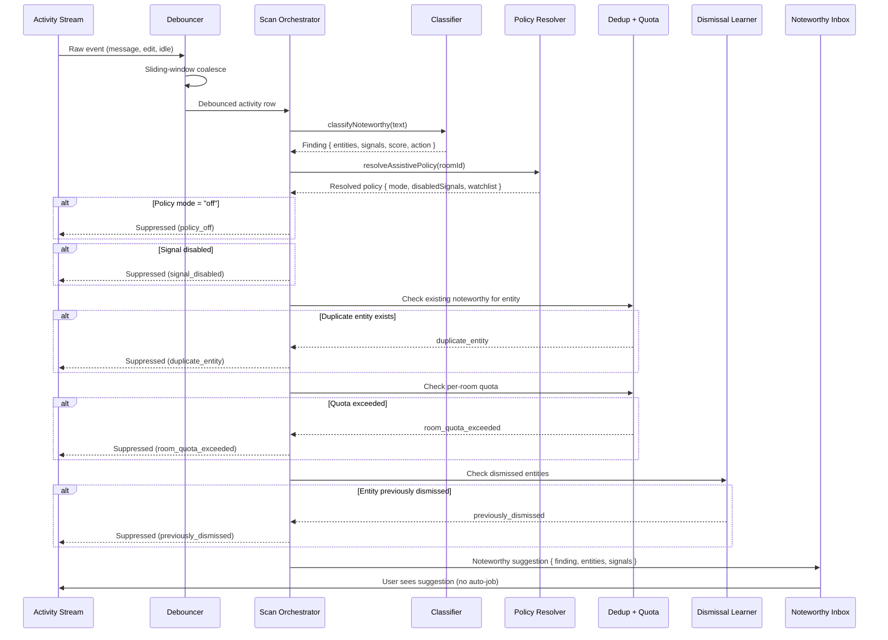

<div align="center">

# NodeMem

### Notice passively. Act explicitly.

A provider-agnostic passive memory component for agent systems.

It notices entities in activity streams, surfaces noteworthy suggestions, learns from dismissals, and deduplicates — **without auto-executing jobs**.

<br>


<sub>↑ NodeMem running inside <a href="https://github.com/HomenShum/noderoom">NodeRoom</a> — passive suggestions surface in the noteworthy inbox, user reviews and explicitly approves before any research job runs.</sub>

</div>

---

## Table of contents

- [Why this exists](#why-this-exists)
- [How it works](#how-it-works)
- [Quick start](#quick-start)
- [Code examples](#code-examples)
- [Architecture](#architecture)
- [Using with Convex](#using-with-convex)
- [Using with any backend](#using-with-any-backend)
- [Signals](#signals)
- [Assistive modes](#assistive-modes)
- [Doctrine](#doctrine)
- [Project structure](#project-structure)
- [License](#license)

---

## Why this exists

Most agent memory systems either:

- **Auto-execute** on every detected entity, flooding job queues and starving foreground work.
- **Remember nothing**, re-suggesting the same dismissed entities endlessly.
- **Tie you to one provider** — Convex, OpenAI, Pinecone — with no escape hatch.

NodeMem fixes all three:

1. **Passive doctrine** — detection creates *suggestions*, not jobs. The caller decides whether to promote.
2. **Dismissal learning** — entities dismissed by users are suppressed in future scans.
3. **Provider-agnostic ports** — `MemoryStore` is an interface. Convex, SQLite, Postgres, in-memory — your choice.

> **Convex is one proof, not the only one.**
> The core is pure TypeScript with zero provider dependencies. Bring your own backend.

---

## How it works



### Pipeline gates (in order)

| Gate | Suppress reason | Description |
|------|----------------|-------------|
| **Policy** | `policy_off` | Room policy is `off` — all detection suppressed |
| **Signal disabled** | `signal_disabled` | Signal kind is in `disabledSignalKinds` |
| **Watchlist** | `not_on_watchlist` | Policy is `approved_watchlist_only` and entity isn't listed |
| **Dedup** | `duplicate_entity` | Active noteworthy suggestion for same entity already exists |
| **Quota** | `room_quota_exceeded` | Room has too many noteworthy suggestions in the last hour |
| **Dismissal** | `previously_dismissed` | Entity was previously dismissed by a room member |

---

## Quick start

### Zero-dependency demo (no install)

```bash
node demo/runNodeMemDemo.mjs
```

<details>
<summary>Expected output</summary>

```
  NodeMem — Zero-dependency demo
  Doctrine: "Notice passively, act explicitly."

  ✓ Entity detected — CardioNova
  ✓ Score > 0.35 — score=0.90
  ✓ 4+ signals — 4 signals
  ✓ Action: start_research_job
  ✓ Dismissal learning works
  ✓ Classifier is deterministic

  Pass: 6  Fail: 0
  ✓ PASSED
```

</details>

### Full TypeScript demo

```bash
npm install
npm run demo
```

<details>
<summary>Expected output</summary>

```
  Step 1: Classify a chat message
  ✓ Entity detected — CardioNova
  ✓ Score > 0.35 — score=0.90
  ✓ Multiple signals — organization_candidate, finance_signal, person_or_interaction, open_question_or_task
  ✓ Action is start_research_job

  Step 2: Scan activity → noteworthy suggestion
  ✓ Scan result is noteworthy

  Step 3: Duplicate entity → dedup suppresses
  ✓ Duplicate suppressed — duplicate_entity

  Step 4: Dismiss entity → re-scan → suppressed
  ✓ Dismissed entity suppressed — previously_dismissed

  Step 5: Policy 'off' → all suppressed
  ✓ Policy 'off' suppresses all — policy_off

  Step 6: Per-room quota exceeded
  ✓ Quota exceeded suppresses — room_quota_exceeded

  Summary: Pass=13  Fail=0
  ✓ DEMO PASSED — all gates green
```

</details>

### Run tests

```bash
npm install
npm test
```

### Run smoke checks

```bash
npm run nodemem:smoke          # Full pipeline smoke
npm run nodemem:in-memory:smoke  # In-memory adapter smoke
npm run nodemem:convex:smoke    # Convex schema validation smoke
```

---

## Code examples

### Classify text for noteworthy entities

```typescript
import { classifyNoteworthy } from "nodemem";

const finding = classifyNoteworthy(
  "Met with CardioNova last week. They just raised Series A and are piloting at three hospitals."
);

console.log(finding.score);           // 0.90
console.log(finding.action);          // "start_research_job"
console.log(finding.entities[0]);     // { displayName: "CardioNova", entityKey: "cardionova", ... }
console.log(finding.signals);         // ["organization_candidate", "finance_signal", "person_or_interaction", ...]
```

### Scan an activity row through the full pipeline

```typescript
import { scanActivity, InMemoryAdapter } from "nodemem";

const store = new InMemoryAdapter();

// Insert activity from your stream
const rowId = store.insertActivity({
  roomId: "room-1",
  sourceKind: "message",
  sourceId: "msg-1",
  sourceHash: "abc123",
  text: "Met with CardioNova about their Series A funding raise.",
  visibility: "room",
});

// Run the full scan pipeline
const result = await scanActivity(store, {
  id: rowId,
  roomId: "room-1",
  sourceKind: "message",
  sourceId: "msg-1",
  sourceHash: "abc123",
  text: "Met with CardioNova about their Series A funding raise.",
  visibility: "room",
});

if (result.status === "noteworthy") {
  // Show suggestion to user. Do NOT auto-create a job.
  console.log(`Noteworthy: ${result.finding?.entities[0]?.displayName}`);
  console.log(`Signals: ${result.finding?.signals.join(", ")}`);
  console.log(`Score: ${result.finding?.score}`);
}
```

### Learn from dismissals

```typescript
// User dismisses "CardioNova" from the noteworthy inbox
await store.recordDismissal("room-1", ["CardioNova"], "user-alice");

// Future scans for CardioNova in this room are suppressed
const dismissed = await store.isEntityDismissed("room-1", ["CardioNova"]);
console.log(dismissed); // true
```

### Set per-room assistive policy

```typescript
// Room owner sets policy to "ask before research"
await store.setRoomPolicy("room-1", {
  mode: "ask_before_research",
  allowExternalCalls: true,
  maxSuggestionsPerHour: 20,
  maxApprovedBackgroundJobsPerDay: 5,
  disabledSignalKinds: [],
  approvedEntityWatchlist: [],
});

// System default (suggestions_only) is overridden by room policy
// Most restrictive setting always wins
```

### Debounce rapid activity

```typescript
import { computeDebounce } from "nodemem";

const now = Date.now();

// First event — fresh debounce window
const d1 = computeDebounce(now, null, 12_000);
console.log(d1.effectiveDelay); // 12000 (ms)

// Second event 3s later — window slides but caps at maxWait
const d2 = computeDebounce(now + 3_000, d1.state, 12_000);
console.log(d2.effectiveDelay); // capped by maxWaitAt - now
```

---

## Architecture

```
src/
  index.ts                    # Public API barrel
  core/
    classifier.ts             # Pure: entity + signal detection from text
    dedup.ts                  # Pure: duplicate entity + per-room quota checks
    dismissalLearner.ts       # Pure: entity dismissal tracking + suppression
    policyResolver.ts         # Pure: assistive policy resolution (most restrictive wins)
    dedupeKey.ts              # Pure: deterministic activity dedupe keys
    debouncer.ts              # Pure: sliding-window debounce logic
    scanOrchestrator.ts       # Orchestrates: classify → policy → quota → dedup → dismiss → noteworthy
  adapters/
    inMemoryAdapter.ts        # Zero-dependency reference MemoryStore implementation
    convexSchema.ts           # Convex table definitions (drop into your convex/ dir)
```

### Port contract

```typescript
interface MemoryStore extends DismissalStore, DedupStore, PolicyStore {
  patchRow(id: string, patch: {
    status: ActivityStatus;
    finding?: NoteworthyFinding;
    updatedAt: number;
  }): Promise<void>;
}
```

Implement this single interface with any backend. The in-memory adapter is the reference.

---

## Using with Convex

1. Copy `src/adapters/convexSchema.ts` into your `convex/` directory.
2. Merge the table definitions into your `schema.ts`:

```typescript
import {
  roomActivityOutbox,
  roomDismissedEntities,
  roomAssistivePolicies,
} from "./nodemem/schema.js";

export default defineSchema({
  // ... your existing tables
  roomActivityOutbox,
  roomDismissedEntities,
  roomAssistivePolicies,
});
```

3. Implement `MemoryStore` against Convex's `MutationCtx` / `QueryCtx`.

---

## Using with any backend

```typescript
import { scanActivity, type MemoryStore } from "nodemem";

// Implement the port with your backend
class MyStore implements MemoryStore {
  async listNoteworthy(roomId: string, limit?: number) {
    // your query — e.g. SQL, Firestore, Supabase
  }
  async countNoteworthyLastHour(roomId: string) {
    // your query
  }
  async isEntityDismissed(roomId: string, entityNames: string[]) {
    // your query
  }
  async recordDismissal(roomId: string, entityNames: string[], by: string) {
    // your mutation
  }
  async getRoomPolicy(roomId: string) {
    // your query
  }
  async setRoomPolicy(roomId: string, policy: AssistivePolicy) {
    // your mutation
  }
  async patchRow(id: string, patch: { status: ActivityStatus; finding?: NoteworthyFinding; updatedAt: number }) {
    // your mutation
  }
}

const store = new MyStore();
const result = await scanActivity(store, {
  id: "row-1",
  roomId: "room-1",
  sourceKind: "message",
  sourceId: "msg-1",
  sourceHash: "abc123",
  text: "Met with CardioNova about their Series A funding raise.",
  visibility: "room",
});

if (result.status === "noteworthy") {
  // Show suggestion to user. Do NOT auto-create a job.
  console.log(`Noteworthy: ${result.finding?.entities[0]?.displayName}`);
}
```

---

## Signals

| Signal | Enum | Trigger | Example |
|--------|------|---------|---------|
| Organization candidate | `organization_candidate` | Capitalized multi-word name or suffix match (Inc, Labs, Bio, etc.) | "CardioNova Inc", "Stripe Labs" |
| Finance signal | `finance_signal` | Series A/B, seed, funding, raise, runway, burn, ARR, revenue, EBITDA, margin, cash | "raised Series A", "runway is 18 months" |
| Person interaction | `person_or_interaction` | Met, spoke, talked, call, founder, CEO, CFO, contact, intro, emailed | "Met with the founder" |
| Research signal | `research_signal` | Product, launch, announced, customer, pilot, hospital, pricing, competitor, market, news | "announced a pilot at three hospitals" |
| Open question / task | `open_question_or_task` | Verify, source, follow up, ask, research, find, confirm, todo, next step, reference | "Need to verify their runway" |
| Source URL | `source_url` | `https://` URL | "See https://example.com" |

### Scoring

- **Base**: 0.18 per detected signal (max 6 signals → 1.08, clamped to 1.0)
- **Thresholds**:
  - `≥ 0.70` → `start_research_job` (4+ signals)
  - `≥ 0.50` → `create_coach_cue` (2+ signals)
  - `≥ 0.35` → `index_only` (1+ signal)
  - `< 0.35` → `ignore`

---

## Assistive modes

| Mode | Behavior | Use case |
|------|----------|----------|
| `off` | All passive detection suppressed. | Quiet mode, focus work |
| `suggestions_only` | Default. Suggestions surface in inbox, no auto-jobs. | Most rooms |
| `ask_before_research` | Suggestions surface, user must approve before any research. | Sensitive rooms |
| `approved_watchlist_only` | Only entities on the approved watchlist get suggestions. | Curated deal rooms |

**Most restrictive setting wins** across system default → room policy.

---

## Doctrine

> **Notice passively, act explicitly.**
> **Passive should create options, not jobs.**

NodeMem detects what's noteworthy and surfaces it as a suggestion. The user — or an explicit approval workflow — decides whether to act. This prevents:

- **Job queue saturation** from passive auto-execution
- **Infinite retry loops** on budget-limited free routes
- **Duplicate suggestions** for the same entity
- **Re-suggesting entities** the user already dismissed

---

## Project structure

```
NodeMem/
├── src/
│   ├── index.ts                  # Public API barrel
│   ├── core/
│   │   ├── classifier.ts         # Entity + signal detection
│   │   ├── dedup.ts              # Duplicate entity + quota checks
│   │   ├── dismissalLearner.ts   # Dismissal tracking + suppression
│   │   ├── policyResolver.ts     # Assistive policy resolution
│   │   ├── dedupeKey.ts          # Deterministic dedupe keys
│   │   ├── debouncer.ts          # Sliding-window debounce
│   │   └── scanOrchestrator.ts   # Full pipeline orchestrator
│   └── adapters/
│       ├── inMemoryAdapter.ts    # Zero-dependency reference
│       └── convexSchema.ts       # Convex table definitions
├── tests/
│   ├── classifier.test.ts        # 11 tests
│   └── scanOrchestrator.test.ts  # 16 tests
├── demo/
│   ├── runNodeMemDemo.ts         # TypeScript demo
│   ├── runNodeMemDemo.mjs        # Zero-dependency demo
│   └── demo-runner.ts            # Shared demo logic
├── scripts/
│   ├── nodemem-smoke.ts          # Full pipeline smoke
│   ├── nodemem-in-memory-smoke.ts # Adapter smoke
│   ├── nodemem-convex-smoke.ts   # Schema smoke
│   └── secret-scan.mjs           # Secret scanner
├── assets/
│   └── noderoom-review-approve.gif
├── package.json
├── tsconfig.json
├── vitest.config.ts
└── README.md
```

---

## License

MIT © Homen Shum
